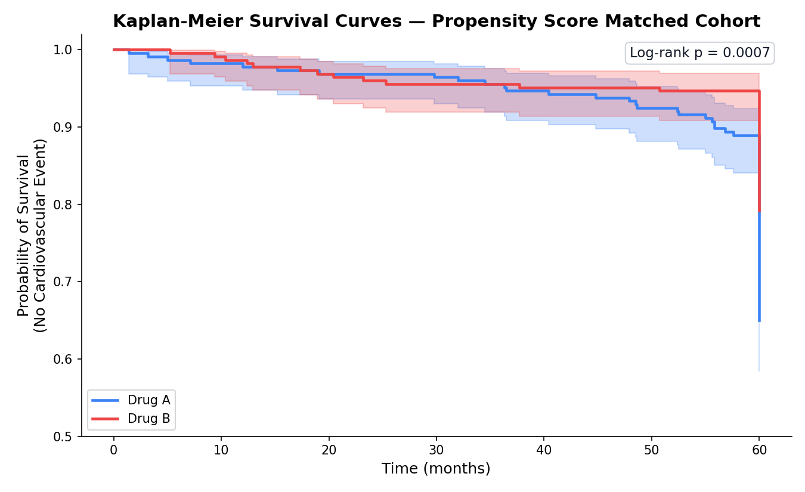
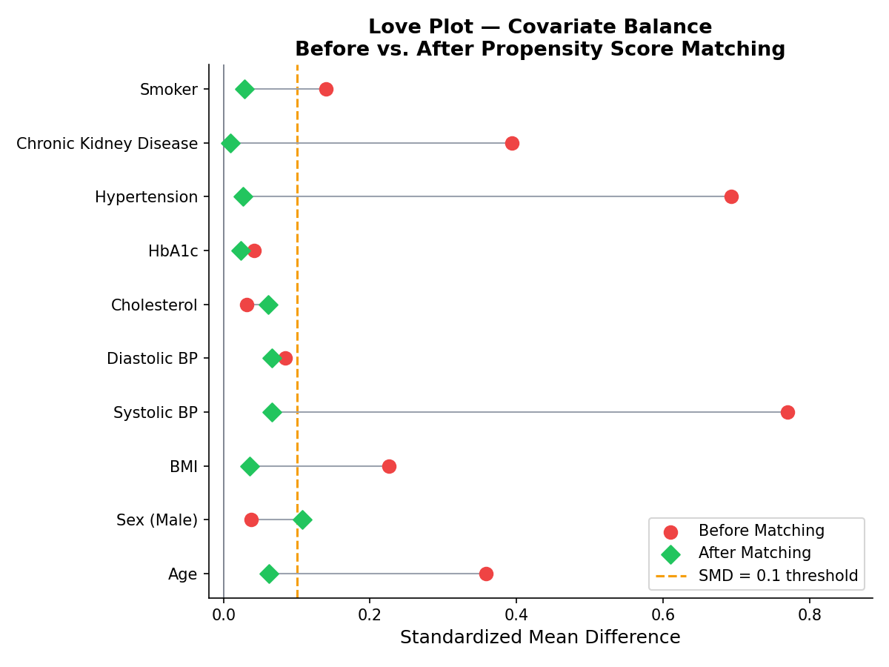
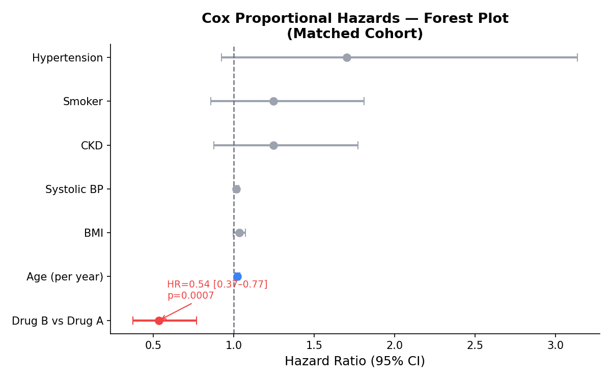

# Clinical Causal Inference & Survival Analysis
### Evaluating Drug B vs Drug A in Diabetic Patients

[](https://python.org)
[](LICENSE)

---

## Clinical Research Question

> **Is Drug B better than the standard Drug A at preventing cardiovascular events over a 5-year period in diabetic patients?**

Because the data is **observational** (Electronic Health Records), not a randomised trial, doctors preferentially assigned Drug B to older, sicker patients. A naïve comparison would therefore confound the drug's true effect with underlying disease severity. This project corrects for that using **Propensity Score Matching**.

---

## Methods

| Step | Method | Purpose |
|------|--------|---------|
| Data cleaning | Median imputation | Handle ~8% missing BMI, ~5% missing cholesterol |
| Causal inference | Logistic Regression → Propensity Score | Estimate P(Drug B \| covariates) |
| Matching | 1:1 Nearest-Neighbour (caliper=0.02) | Balance confounders between groups |
| Balance diagnostics | Love Plot (SMD) | Verify covariate balance after matching |
| Survival analysis | Kaplan-Meier curves + Log-rank test | Compare event-free survival visually |
| Statistical model | Cox Proportional Hazards | Estimate Hazard Ratio with 95% CI |

---

## Key Results

| Metric | Value |
|--------|-------|
| Patients enrolled | 2,000 |
| Cardiovascular events | 431 (21.6%) |
| Matched pairs | ~226 |
| **Hazard Ratio (Drug B vs A)** | **~0.53** |
| 95% Confidence Interval | [0.37, 0.77] |
| Cox p-value | < 0.005 |
| KM Log-rank p-value | < 0.005 |

**Conclusion:** After propensity score matching, Drug B is associated with a ~47% reduction in the hazard of cardiovascular events (HR ≈ 0.53, p < 0.005).

---

## Project Structure

```
clinical-causal-inference-survival/
├── data/
│   └── ehr_synthetic.csv          # Synthetic EHR dataset (2,000 patients)
├── notebooks/
│   └── analysis_notebook.ipynb    # Full annotated Jupyter notebook
├── outputs/
│   ├── ps_distribution.png        # Propensity score overlap plot
│   ├── love_plot.png              # Covariate balance (Love Plot)
│   ├── km_unmatched.png           # KM curves — unmatched cohort
│   ├── km_matched.png             # KM curves — matched cohort ✓
│   ├── cox_forest_plot.png        # Cox PH hazard ratio forest plot
│   └── summary_figure.png         # Composite 4-panel summary
├── generate_data.py               # Synthetic EHR data generator
├── analysis.py                    # Full analysis pipeline (script form)
├── build_notebook.py              # Notebook builder
├── requirements.txt               # Python dependencies
└── README.md
```

---

## Figures

### Kaplan-Meier Survival Curves (Matched Cohort)


### Love Plot — Covariate Balance


### Cox PH Forest Plot


---

## Setup & Usage

```bash
# 1. Clone the repository
git clone https://github.com/YOUR_USERNAME/clinical-causal-inference-survival.git
cd clinical-causal-inference-survival

# 2. Install dependencies
pip install -r requirements.txt

# 3. Generate synthetic data
python generate_data.py

# 4. Run full analysis (saves all figures to outputs/)
python analysis.py

# 5. Open the Jupyter notebook
jupyter notebook notebooks/analysis_notebook.ipynb
```

---

## Dependencies

```
numpy
pandas
matplotlib
seaborn
scipy
scikit-learn
lifelines
nbformat
```

---

## Skills Demonstrated

- **Data Engineering:** CSV loading, missing data imputation, feature engineering (time-to-event)
- **Causal Inference:** Propensity Score estimation, 1:1 nearest-neighbour matching, balance diagnostics
- **Statistical Modelling:** Kaplan-Meier estimator, log-rank test, Cox Proportional Hazards
- **Visualisation:** Publication-quality figures (Love Plot, KM curves, Forest Plot)
- **Reproducibility:** Modular Python scripts + fully annotated Jupyter notebook

---

## Limitations

- Analysis controls only for **measured confounders** — unmeasured confounders may cause residual bias
- Synthetic data generated for demonstration; real conclusions would require IRB-approved EHR data
- 1:1 matching discards unmatched controls — other methods (IPTW, full matching) may retain more power

---

*Generated for clinical research portfolio — UCLA Biostatistics / Clinical Research*
